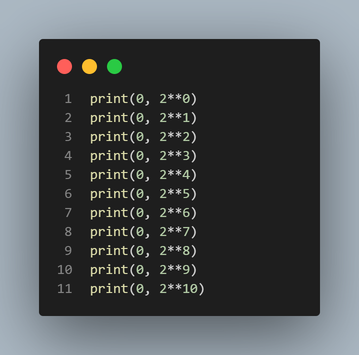
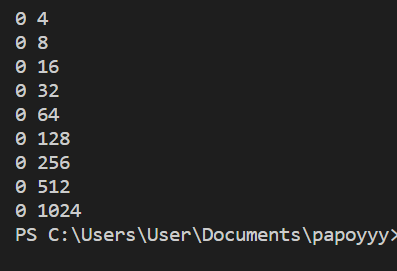
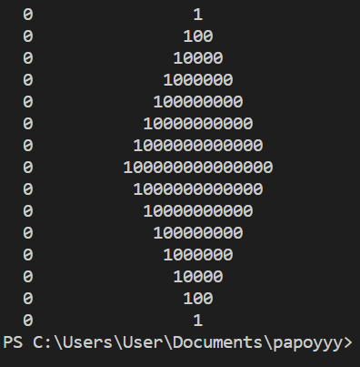
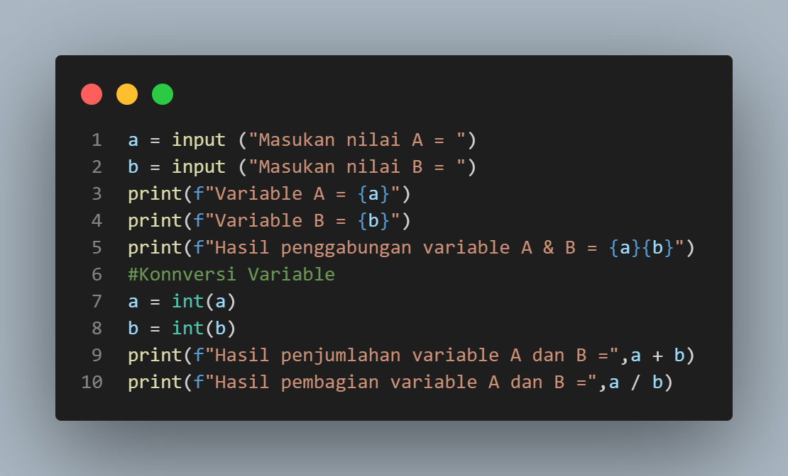
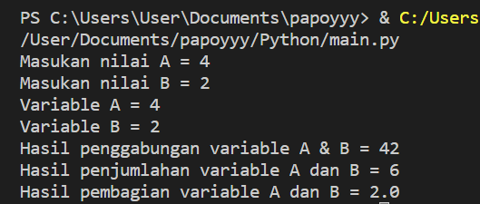
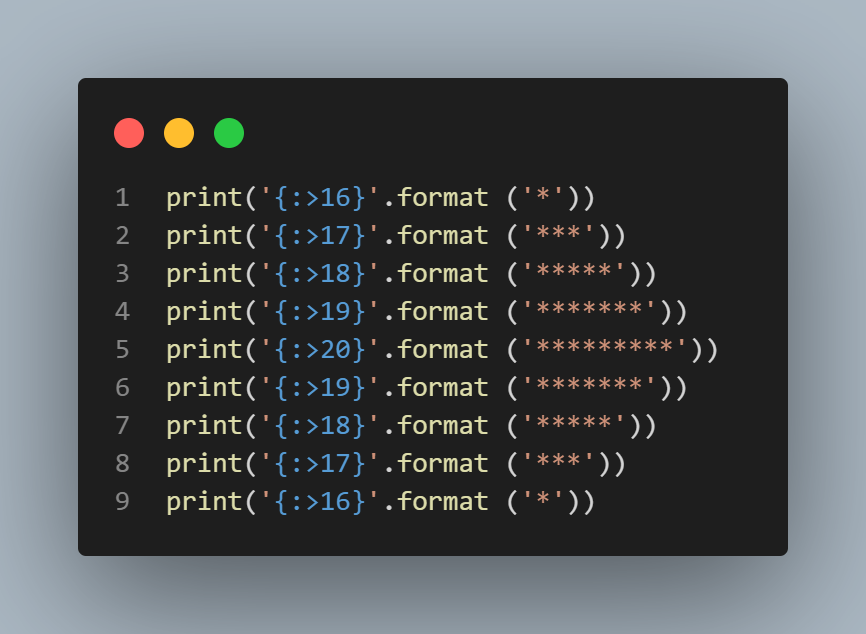

# Latihan 1
## Parameter "End"
#### Parameter end berfungsi untuk mengganti karakter terakhir bawaan yang dicetak di layar contohnya.

## Parameter "Separator (sep)"
#### Ketika kita memanggil fungsi print() untuk menampilkan multi argumen, python akan otomatis menambahkan karakter spasi sebagai pemisah antar argumen tersebut. Jika kita tidak ingin pemisah spasi, maka kita bisa menambahkan parameter sep (separator) saat memanggil print() sebagai contohnya.

## String Format
#### String sendiri adalah potongan teks. Mereka dapat didefinisikan sebagai apa saja di antara tanda kutip. Berikut ini adalah contoh Python String Format.

## String Format

# Latihan 2

# Latihan 3

